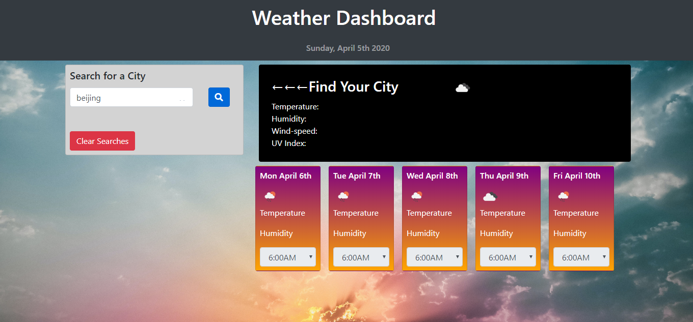
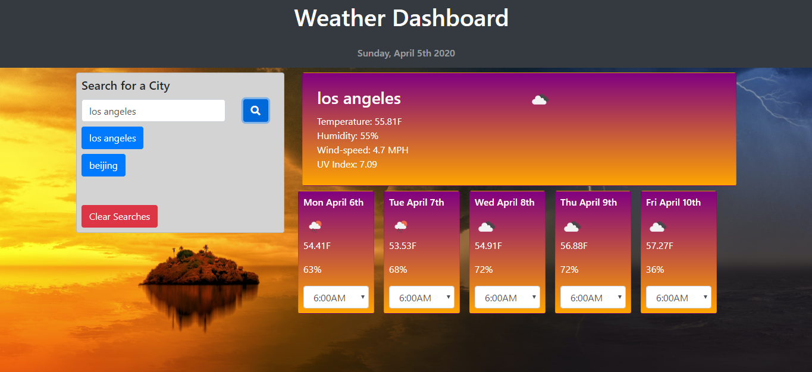
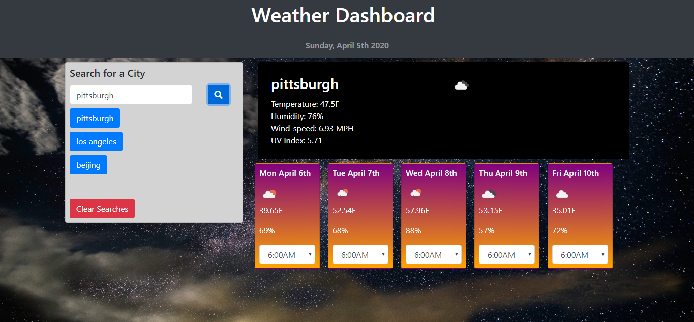
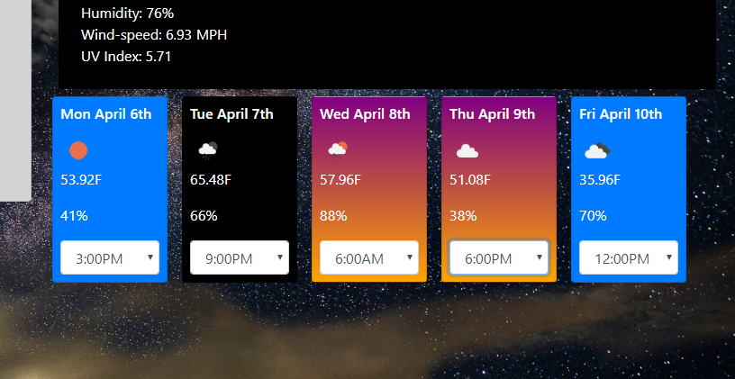

## Weather Dashboard
This repository contains code for a weather dashboard app. The app displays the current date, current weather, and a 5-day forecast for a city that the user searches for. In addition, the app saves the user's previously searched cities and allows the user to click on those cities to readily pull up their info again. The deployed application can be found here: [https://dvorakjt.github.io/weather-dashboard/](https://dvorakjt.github.io/weather-dashboard/)

## Tools/Languages Used
- HTML/Javascript/CSS
- Bootstrap
- jQuery
- Openweather API
- Moment.js
- Moment-timezone.js
## Features
The background and some of the styling changes depending on the time of day in the city you search:

 I used moment.js and moment-timezone.js to accomplish this.
The openweather API actually returns the city's UTC offset in seconds as a property of the JSON object that is returned. I used the following code to obtain this value:

    var  offset = response.timezone / 60;
The offset value is then fed to the updateDay() function, which then uses the moment-timezone predefined methods .utc() and .utcOffset(offset) to determine the time in that location.

    var  today = moment().utc().utcOffset(offset).format("dddd, MMMM Do 	
    YYYY"); 
	var  thisHour = moment().utc().utcOffset(offset).hour();

Additionally, each day in the 5-day forecast features a drop-down tab that allows the user to select a time to check the forecast at. Since the openweather API returns a forecast in 3-hour increments, I decided to use this specificity to the user's advantage rather than muddying it. The styling of the particular day in the forecast even changes to match the time of day that the user is querying:

When the user enters a city, it is saved to an array of cities, which is in turn saved to local storage. These cities are displayed as buttons to the right. Clicking any of these buttons activates the same search functions that searching via the search input bar does. The only difference is that instead of capturing the value of the input element, the actual text of the button is captured and searched with. 

Before buttons are added, a for loop combs the cities array and deletes any pre-existing instances of the city name, so that each city name only appears once. The city name is then added tot he end of the array, and thus appears as the most recently searched city in the city buttons section.

    for (let  i = 0; i < cities.length; i++) { 
		if (cities[i] === myCity) {
			cities.splice(i, 1);
		}
	}
	cities.push(myCity);

Finally, a clear button empties the cities section, and resets the cities array to [], saving this value to localStorage.